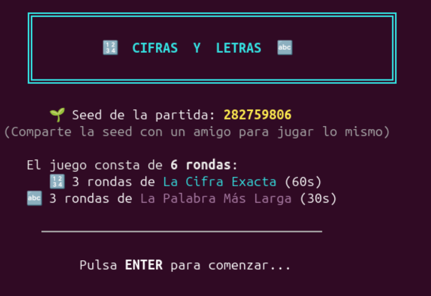
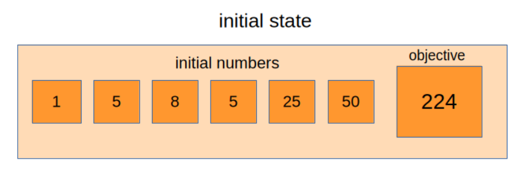
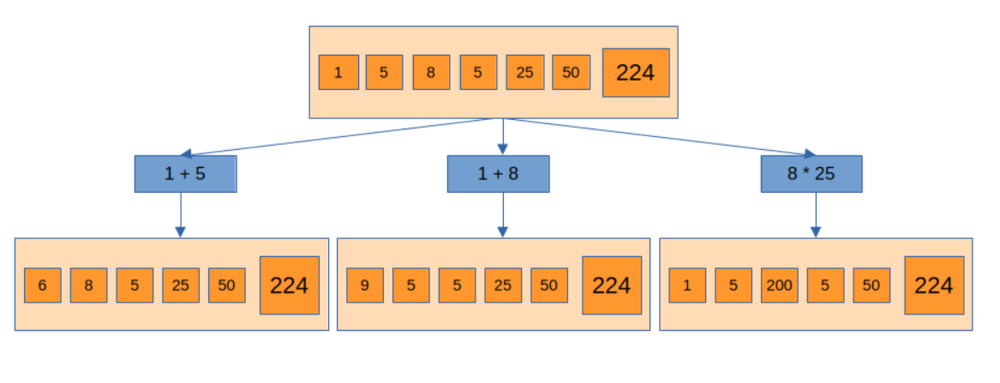

# Cifras y Letras
v0.1

**Authors**: Alejandro Moreno Guerrero, Claude Opus 4.6

This repository is a game based on the TV show "Cifras y Letras", which is also known by other names in other countries such as "Countdown" in Great Britain, "Letters and Numbers" in Australia or "Cifers en Letters" in Belgium.

## About

The game contains the two main games of the TV show: "La cifra exacta" and "La palabra más larga" which are, in short, the games with numbers and letters, respectively.

In each game there are 3 rounds of La cifra exacta and 3 rounds of La palabra más larga. The objective is to score many points by playing as best as you can. Here is what you need to know about each game:

### La cifra exacta

You are given 6 numbers and an objective. Numbers can range from 1 to 10 and also 25, 50, 75 or 100. The objective is a 3-digit number that you have to calculate with the given numbers and basic arithmetic.

You can only use the initial numbers or the results of previous operations. You can only use each number once. You have in total 60 seconds to do operations.

The closer you end up to the objective, the more points you will score:

- 10 points if you get the exact number
- 7 points if the difference is less than or equal to 2
- 5 points if the difference is less than or equal to 5
- 2 points if the difference is less than or equal to 10

### La palabra más larga

This time, you will play with letters. You are given 5 vocals and 5 consonants, all of them random. The objective is to form the longest possible word with those letters.

The points you score are equal to the number of letters of the longest word you found during the 30 seconds that are given to you. You can try as many words as you want. Important: words must be in the dictionary and they must be spelled properly.

## How to play

First, install the dependencies:

    pip install numpy

Download or clone the repository and execute:

    python juego.py

or:

    python juego.py --seed <a number>

The option --seed followed by any positive number allows you to replicate exactly the same game. Use this feature to challenge your friends!

## Computer solutions

At the end of each round of La cifra exacta or La palabra más larga, the computer will solve the game. In the case of La cifra exacta, it will find the shortest path to the objective or to the nearest number in case that the objective is not reachable. Whereas in La palabra más larga, it will display a list of the longest words that can be formed.

Developing the algorithms for the computer to solve the game has been a rewarding challenge. Next, I will show how these algorithms work for each game:

### La cifra exacta

There are thousands of sequences of operations that can be formed with the initial numbers. How can we find one of the few sequences that result in the exact objective? Well, let's try to represent the problem. At the beginning, we have an initial state of the first 6 numbers. With those, we can do operations that bring us to another state, in which we will have other numbers to do operations that would bring us to yet another state, and so on. Once that we achive one state that produces the objective as a result of a pair of its numbers, we are done! Therefore, the problem can be reduced to find a way to navigate among all the possible states that are derived from the initial.

We can represent the problem as a tree in which the nodes are each of the states and two states are linked if there is an operation from one that brings us to the other one, as shown in the image:

The most straightforward to navigate this tree is using a recursive function. This function does two things: 

1. checks if the objective is reached.
2. generates all the possible next states and calls itself for each of these.

This algorithm is complete. Therefore, all the possible states are checked and the objective will be calculated if it is reachable. In the case that the objective is not reachable, the algorithm will calculate the nearest reachable number to the objective. In any case, the algorithm will return the sequence of steps in which the most approximate number is calculated.

In regards to efficiency, this algorithm is adequate for this problem as it only takes one or two seconds to execute. However, if we wanted a similar and optimally efficient algorithm, an A* search would be an ideal substitute.

### La palabra más larga

Searching for the longest word that can be formed using ten random letters involves two possible approaches:

- Joining letters randomly until a word in the dictionary comes out
- Looking every word in the dictionary to see if it can be formed

Both approaches require to do quite a lot of trial and error. However, if we look at the magnitude of the numbers, we can confidently decide which is the best option. If we take the first approach, only for words of 10 letters, we require to try 10! = 3,628,800 combinations. This puts us in an order of magnitude of millions. On the other hand, by taking the second approach, we will have to try only hundred of thousands of words. This means roughly a 90 % decrease in execution time with respect to taking the first approach. Therefore, it is best to look each word in the dictionary, starting with the words of 10 letters in the file `10.txt` and reducing its length looking in the respective files if no one is found.

The execution time to solve this game is even lower to La cifra Exacta. So, great news! We have a very responsive game which is fun and pleasant to play.

### Acknowledgments

First of all, thank you to the program Cifras y Letras that inspired me to make this game. I absolutely love this format, the presenters and everybody involved to make this exist.

Thank you to the person(s) that created the list of words. I'm really sorry but I can't mention you! I downloaded it several months ago and don't remember where did I take it from. The list is exactly what I was looking for, as it not only includes every word of a typical dictionary, but also all the forms that they can take: plurals, conjugations, etc. And also words came already classified by its length, which is incredibly useful for this purpose.

